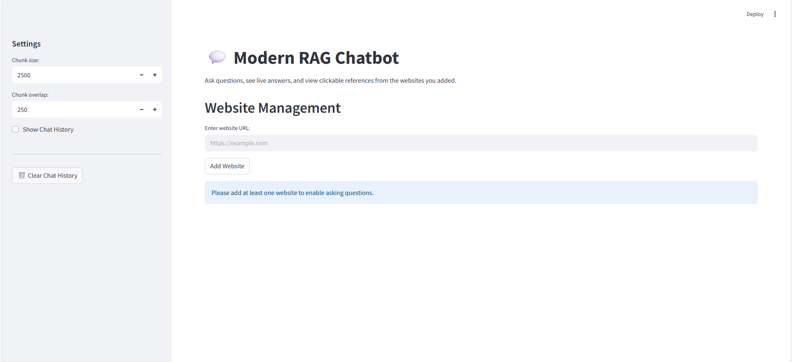
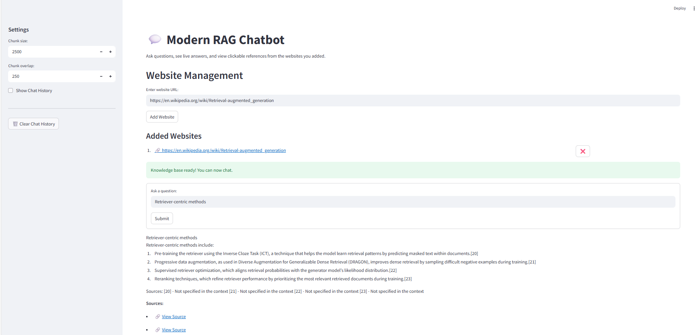

# 💬 Modern RAG Chatbot
A modern **Retrieval-Augmented Generation (RAG)** chatbot built with **Streamlit**, **LangChain**, and **Groq LLMs**.  
Ask questions from multiple websites, get real-time answers, and see clickable references — all wrapped in a sleek chat-bubble UI. 

---
## 🔹 Features
- 🔗 **Add any website** — build a knowledge base from live web pages.  
- 📑 **Smart document splitting** — configurable chunk size & overlap.  
- 🤖 **LLM-powered answers** — uses Groq's **Llama 3.1 8B Instant** model.  
- 💬 **Modern chat bubbles** — clean, WhatsApp-style conversation UI.  
- 📚 **Source attribution** — shows only the references actually used in answers.  
- 🗑️ **Manage chat history** — clear or review past Q&A anytime.  

---

## ⚡ How It Works

1. **Add Websites** – Enter the URL to add sources for the chatbot.  
2. **Document Loading** – The bot scrapes the web pages, splits them into chunks, and stores embeddings in a **Chroma vector store**.  
3. **Ask Questions** – Type your query; the bot retrieves relevant chunks and generates an answer.  
4. **Sources Extraction** – Only the chunks actually used in the answer are shown as clickable links.  
5. **Chat History** – Optionally view previous questions and answers with sources.  

---

## 🛠️ Tech Stack
- [Streamlit](https://streamlit.io/) – interactive web UI  
- [LangChain](https://www.langchain.com/) – document loading, splitting & retrieval  
- [Chroma](https://www.trychroma.com/) – vector database for semantic search  
- [Groq](https://groq.com/) – blazing-fast inference for LLMs  
- [OpenAI Embeddings](https://platform.openai.com/) – vector embeddings for docs  

---

## 🚀 Getting Started

1️⃣ Clone the repository

```bash
git clone https://github.com/pathareprashant5/modern-rag-chatbot.git
cd web-rag-chatbot

2️⃣ Install dependencies
pip install -r requirements.txt

3️⃣ Set up API keys
OPENAI_API_KEY=your_openai_api_key
GROQ_API_KEY=your_groq_api_key

4️⃣ Run the app
streamlit run rag.py

📌 Usage
    1. Add websites.
    2. Ask a question in the main panel.
    3. The bot will stream its answer, and below it will display sources that were actually used.
    4. Remove websites using the ❌ buttons in the sidebar if needed.
    5. Enable Show Chat History in the sidebar to review past interactions

🖼️ Screenshots




🔗 Example
Question: What is LangChain?
Answer: LangChain is a framework for building applications powered by language models...
Sources:
- 🔗 [View Source](https://www.langchain.com/docs)

💡 Future Improvements
Support PDFs, YouTube transcripts, and local documents as additional sources.
Add user authentication to save private chat history.
Improve source highlighting in the answer text

📝 License


This project is licensed under MIT License – see the LICENSE file for details.

